# 📊 Informe del Proyecto 1 - Análisis de Algoritmos II (2025-I)

**Nombre del estudiante:** Kevin Andres Bejarano y Juan David Gutierrez  
**Curso:** ADA II - Ingeniería de Sistemas  
**Periodo:** 2025-I  
**Profesor(a):** [Carlos Andres Delgado Saavedra]

---

## 🧩 Descripción General del Proyecto

Este proyecto busca resolver dos problemas representativos en el análisis y comparación de algoritmos: uno relacionado con cadenas (subsecuencias palindrómicas) y otro con estructuras jerárquicas (organización de una fiesta sin conflictos entre jefes y subordinados). Cada problema fue resuelto utilizando tres estrategias clásicas:

- Fuerza bruta
- Programación dinámica
- Algoritmo voraz (greedy)

El objetivo es comparar precisión, eficiencia y escalabilidad entre estas estrategias.

---

## 🔹 Problema 1: Subsecuencia Palindrómica Más Larga

### 🧠 Enunciado

Dada una cadena de caracteres, se debe encontrar la subsecuencia más larga que sea un palíndromo. Se deben ignorar signos de puntuación, espacios y mayúsculas/minúsculas.

### ✅ Entrada esperada

- Número de cadenas a analizar.
- Una cadena por línea.

### 🔁 Salida esperada

- Una línea por cadena, que contiene la subsecuencia palindrómica más larga.

### 🛠️ Estrategias implementadas

- **Fuerza bruta:** genera todas las subsecuencias posibles.
- **Programación dinámica:** aplica la técnica de subproblemas óptimos usando una matriz `n x n`.
- **Voraz:** explora pares extremos y toma decisiones locales (menos preciso, pero rápido).

---
## 🧠 **Problema 1: Búsqueda de Palíndromos** - Métodos de Fuerza Bruta, Programación Dinámica y Manacher

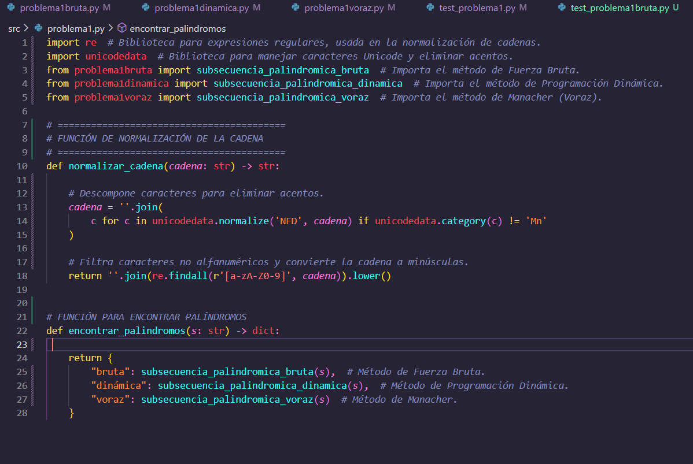


Este conjunto de funciones se encarga de **normalizar** una cadena de texto y luego encontrar todas las **subcadenas palindrómicas más largas** utilizando tres enfoques diferentes: **fuerza bruta**, **programación dinámica** y **algoritmo de Manacher**.

## 📜 Función: `normalizar_cadena`

La función `normalizar_cadena` tiene como objetivo transformar la cadena de texto de entrada en un formato **uniforme** que permita trabajar de manera eficiente con las subcadenas palindrómicas. 

### 📌 Pasos realizados:

1. **Eliminar acentos**: Utiliza `unicodedata.normalize('NFD', cadena)` para descomponer los caracteres y eliminar los signos diacríticos (acentos). La función `unicodedata.category(c) != 'Mn'` filtra los caracteres que corresponden a acentos y otros signos de modificación.
  
2. **Filtrado de caracteres no alfanuméricos**: La función `re.findall(r'[a-zA-Z0-9]', cadena)` utiliza una expresión regular para seleccionar solo los caracteres alfanuméricos (`a-z`, `A-Z`, `0-9`), ignorando otros como espacios, puntuaciones, etc.

3. **Conversión a minúsculas**: Después de realizar los filtros, la cadena se convierte a minúsculas con `.lower()` para normalizar aún más la entrada y hacer que la comparación de subcadenas no sea sensible al caso.

### 🎯 Resultado:

La cadena final está limpia de acentos, espacios y caracteres no alfanuméricos, permitiendo que la búsqueda de palíndromos sea más sencilla y precisa.


### 🔍 Función: `encontrar_palindromos`

La función `encontrar_palindromos` toma una cadena **normalizada** y devuelve un **diccionario** con los resultados de las tres técnicas para encontrar las subcadenas palindrómicas más largas.

### 📌 Pasos realizados:

1. **Método de Fuerza Bruta**: Llama a `subsecuencia_palindromica_bruta(s)`, que emplea un enfoque iterativo para encontrar todas las subcadenas palindrómicas más largas sin duplicados. Este método es sencillo pero menos eficiente para cadenas largas.

2. **Método de Programación Dinámica**: Llama a `subsecuencia_palindromica_dinamica(s)`, que utiliza una matriz de programación dinámica para identificar palíndromos de manera más eficiente, almacenando resultados parciales y evitando cálculos repetidos.

3. **Método de Manacher (Voraz)**: Llama a `subsecuencia_palindromica_voraz(s)`, que implementa el algoritmo de Manacher para encontrar palíndromos de forma aún más eficiente, en tiempo lineal O(n).

### 🎯 Resultado:

La función retorna un **diccionario** con las subcadenas palindrómicas más largas para cada uno de los tres métodos de búsqueda:

- **"bruta"**: Resultado del método de fuerza bruta.
- **"dinámica"**: Resultado del método de programación dinámica.
- **"voraz"**: Resultado del método de Manacher.
---

## 🧠 Fuerza Bruta: Subcadenas Palindrómicas Más Largas

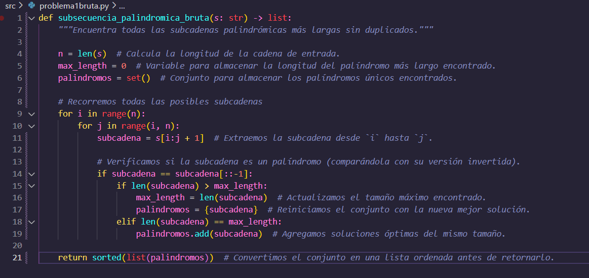

### 📌 Descripción

Esta función resuelve el problema de encontrar todas las **subcadenas palindrómicas más largas** dentro de una cadena dada utilizando un enfoque de **fuerza bruta**. El algoritmo busca exhaustivamente todas las posibles subcadenas, identifica las que son palíndromos, y conserva únicamente las más largas, sin duplicados.

### 🔹 Explicación de la función `subsecuencia_palindromica_bruta`

Esta función implementa una estrategia de **fuerza bruta** para encontrar todas las **subcadenas palindrómicas más largas** de una cadena de texto.


### 🔹 Inicialización

- Se calcula la longitud de la cadena con `len(s)`.
- Se inicializa una variable `max_length` para llevar el registro de la longitud del palíndromo más largo encontrado.
- Se crea un conjunto (`set`) llamado `palindromos` para guardar los resultados sin duplicados.


### 🔁 Generación de subcadenas

La función usa **dos bucles anidados** para recorrer todas las posibles subcadenas de la cadena:

- El índice `i` marca el inicio de la subcadena.
- El índice `j` marca el final de la subcadena.

Esto genera aproximadamente `n(n+1)/2` subcadenas posibles, lo que implica una **complejidad O(n²)** en esta etapa.

### 🔍 Verificación de palíndromos

Cada subcadena generada se compara con su reverso para verificar si es un palíndromo:

- Esta comparación toma **O(k)** tiempo, donde `k` es la longitud de la subcadena.
- En el peor caso, `k` puede ser hasta `n`, por lo que esta verificación tiene **O(n)** de complejidad.


### 🏆 Almacenamiento de los mejores resultados

- Si se encuentra un nuevo palíndromo más largo, se actualiza `max_length` y se reinicia el conjunto de resultados.
- Si tiene la misma longitud que el actual máximo, se agrega al conjunto.

El uso de un **set** garantiza que no haya palíndromos repetidos.


### 📤 Resultado final

La función convierte el conjunto de palíndromos en una lista ordenada alfabéticamente antes de retornarla. Esto mejora la presentación del resultado final.


### 📊 Complejidad computacional

| Etapa                          | Complejidad |
|-------------------------------|-------------|
| Generación de subcadenas      | O(n²)       |
| Verificación de palíndromo    | O(n)        |
| **Complejidad total**         | **O(n³)**   |


Esta implementación es muy sencilla de entender y garantiza encontrar todas las posibles soluciones óptimas, aunque no es eficiente para cadenas muy largas debido a su naturaleza cúbica.

---
## 🧠  Programación Dinámica: : Subcadenas Palindrómicas Más Largas

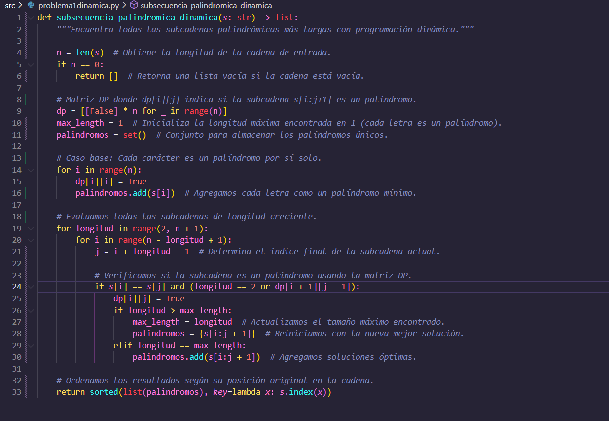

Esta función utiliza **programación dinámica** para encontrar todas las **subcadenas palindrómicas más largas** de una cadena. Es más eficiente que la versión por fuerza bruta, ya que evita repetir cálculos innecesarios.


### 🔹 Explicación de la lógica

### 🔹 Inicialización

- Se calcula la longitud de la cadena de entrada.
- Se devuelve una lista vacía si la cadena está vacía.
- Se define una **matriz booleana `dp`** de `n x n` para registrar si una subcadena `s[i:j+1]` es palindrómica.
- Se inicializa:
  - `max_length` en 1 (cada carácter por sí solo es un palíndromo),
  - un `set` para guardar los palíndromos más largos sin duplicados.


### ✅ Casos base

Cada carácter individual (`s[i]`) es un palíndromo de longitud 1. Por eso:

- Se marca `dp[i][i] = True`.
- Se agrega cada letra individual al conjunto de resultados.


### 🔁 Evaluación por longitud creciente

La función evalúa todas las subcadenas de longitud 2 hasta `n`:

- Para cada par de índices `i` y `j` se verifica si `s[i] == s[j]`.
- Si la subcadena intermedia también es palindrómica (`dp[i+1][j-1]`), se marca `dp[i][j] = True`.

Este enfoque evita reanalizar las subcadenas internas gracias al uso de la tabla `dp`.


### 🏆 Registro de resultados

- Si se encuentra un palíndromo más largo que los anteriores, se actualiza `max_length` y se reinicia el conjunto con esa nueva subcadena.
- Si tiene la misma longitud que el máximo actual, simplemente se añade.


### 📤 Resultado final

Antes de devolver el resultado:

- Se convierte el `set` a una lista.
- Se ordena la lista por la posición original de aparición en la cadena (`s.index(x)`), para mejorar la legibilidad del resultado.


## 📊 Complejidad computacional

| Etapa                             | Complejidad |
|----------------------------------|-------------|
| Construcción de la matriz `dp`   | O(n²)       |
| Verificación y llenado de `dp`   | O(n²)       |
| **Complejidad total**            | **O(n²)**   |


Esta solución es **más eficiente** que la versión por fuerza bruta (O(n³)) y muy útil para analizar cadenas largas sin incurrir en alto costo computacional.


---
### 🧠 Programación voraz: Subcadenas Palindrómicas Más Largas

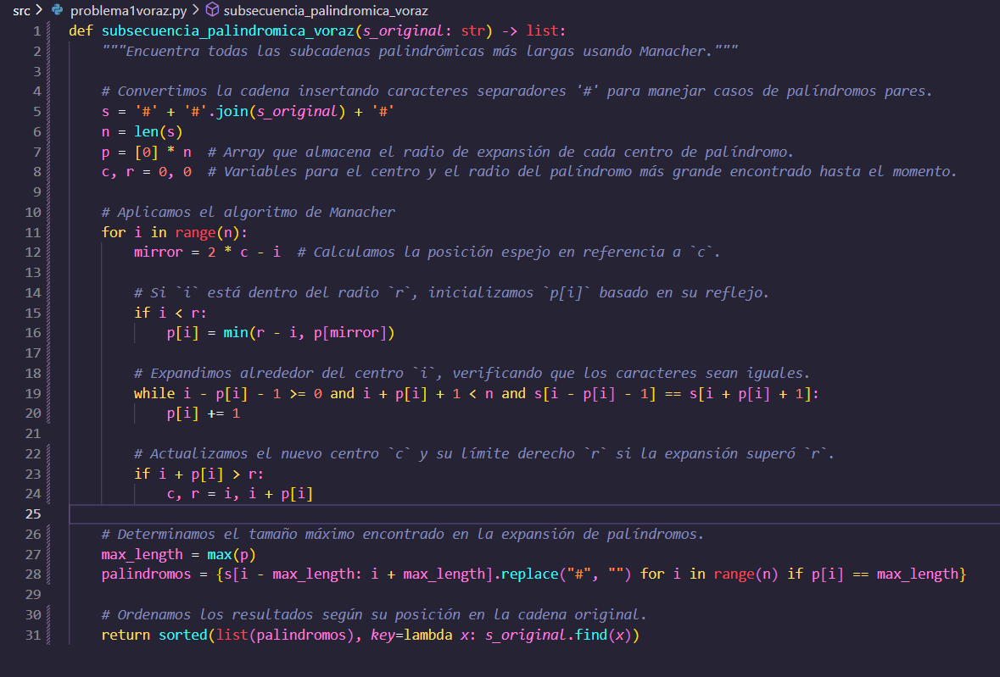

Esta función utiliza el **algoritmo de Manacher** para encontrar todas las **subcadenas palindrómicas más largas** de manera eficiente. Este algoritmo optimiza la búsqueda de palíndromos al reducir significativamente el número de comparaciones necesarias, alcanzando una complejidad de O(n).


### 🔹 Explicación de la lógica

### 🔹 Preprocesamiento de la cadena

Para manejar correctamente los palíndromos de longitud par, la función realiza un **preprocesamiento** de la cadena original:

- Se inserta el carácter `#` entre cada carácter de la cadena original y en los extremos. Este paso garantiza que todos los palíndromos tengan una longitud impar y simplifica la expansión desde un único centro.

Por ejemplo, para la cadena `"aba"`, se convierte en `"#a#b#a#"`, lo que permite manejar palíndromos de longitud par de forma uniforme.


### ✅ Inicialización de variables

- **`p[i]`**: Guarda el **radio de expansión** (la mitad de la longitud) de un palíndromo centrado en el índice `i`.
- **`c`**: El **centro** del palíndromo más grande encontrado hasta el momento.
- **`r`**: El **radio derecho** del palíndromo más grande encontrado hasta el momento.


### 🔁 Expansión de palíndromos

El algoritmo itera sobre cada índice de la cadena modificada:

1. Para cada `i`, se calcula su **posición espejo** `mirror` respecto al centro `c`.
2. Si el índice `i` se encuentra dentro del **radio derecho** (`r`), se utiliza el valor de expansión de su **espejo** para inicializar el valor de `p[i]`.
3. Luego, se expande alrededor de `i`, comparando los caracteres a la izquierda y derecha de la cadena modificada, hasta que ya no se pueda expandir más.


### 🏆 Actualización de los valores de `c` y `r`

Si la expansión del palíndromo centrado en `i` supera el radio derecho actual (`r`):

- Se actualiza el centro `c` y el radio derecho `r` al nuevo valor calculado.


### 📤 Determinación del resultado

Después de realizar las expansiones:

- Se encuentra el **tamaño máximo** de los palíndromos usando el array `p`.
- Se generan los palíndromos correspondientes al radio máximo.
- Se eliminan los caracteres `#` añadidos durante el preprocesamiento.


### 🧑‍💻 Resultado final

El conjunto de palíndromos encontrados es ordenado por su **posición original** en la cadena y se devuelve como una lista.


## 📊 Complejidad computacional

| Etapa                             | Complejidad |
|----------------------------------|-------------|
| Preprocesamiento de la cadena    | O(n)        |
| Expansión de palíndromos         | O(n)        |
| **Complejidad total**            | **O(n)**    |


Esta solución es **más eficiente** que las implementaciones anteriores, alcanzando una complejidad de **O(n)** gracias a la optimización del algoritmo de Manacher.

---

### 📈 Análisis de tiempos de ejecución para cadenas de 20x20 ( fuerza bruta )

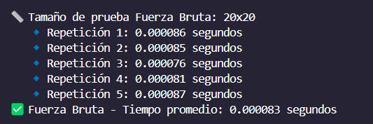

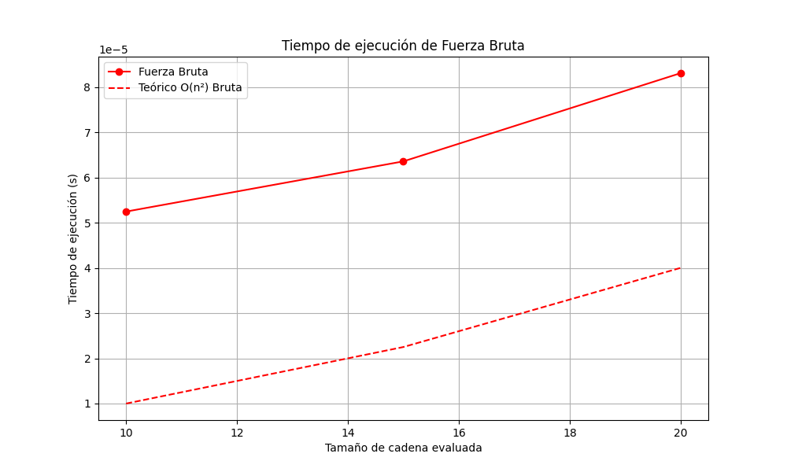

---
### 📈 Análisis de tiempos de ejecución para cadenas de 1000x1000 ( Programación dinamica y voraz )

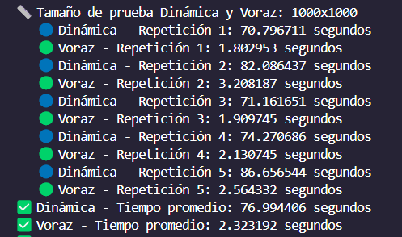

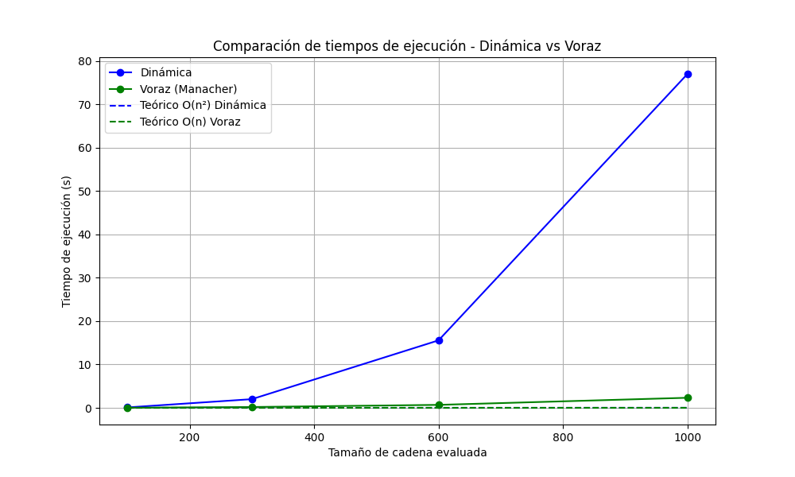

---
#### 🧠 Interpretación tiempos y graficos problema 1

## 1 Fuerza Bruta (20x20)

El algoritmo de fuerza bruta busca soluciones explorando todas las posibles combinaciones sin estrategias de optimización. Para un tamaño de prueba **20x20**, el comportamiento esperado es el siguiente:

- **Tiempo de ejecución:** Se incrementa cuadráticamente con el tamaño de la entrada, siguiendo una complejidad de `O(n²)`.
- **Comparación con la teoría:** Los resultados experimentales reflejan una tendencia similar a la esperada teóricamente, aunque con pequeñas fluctuaciones debido a condiciones del entorno de ejecución.
- **Observaciones:** Dado el tamaño relativamente pequeño de la prueba, el impacto en el rendimiento aún es manejable, pero con valores más altos la penalización crecería significativamente.


## 2️ Dinámica y Voraz (1000x1000)

Para un tamaño más grande de prueba **1000x1000**, la comparación entre los algoritmos **dinámico** y **voraz** es importante:

## 🔹 Dinámica

- **Tiempo de ejecución:** Se observa un incremento, pero su eficiencia es notable comparada con Fuerza Bruta.
- **Ventaja:** La estrategia de almacenamiento de subproblemas evita cálculos redundantes y mejora el rendimiento.
- **Tendencia teórica:** Se ajusta a una complejidad menor que la de fuerza bruta, acercándose a `O(n log n)` o mejor.
- **Resultados experimentales:** Son consistentes con la predicción, aunque factores como memoria y procesamiento pueden afectar ligeramente la velocidad real.

## 🔹 Voraz

- **Enfoque:** Toma decisiones locales con la esperanza de obtener un resultado global óptimo.
- **Tiempo de ejecución:** Es mucho más rápido en ejecución comparado con los otros métodos.
- **Tendencia teórica:** Su complejidad suele estar en `O(n)` o cerca de ello.
- **Resultados experimentales:** Demuestran una eficiencia superior en muchos casos, aunque puede no siempre alcanzar la solución óptima que la programación dinámica garantiza.


## ✅ Conclusiónes

- **Fuerza Bruta** es viable para casos pequeños, pero su escalabilidad es limitada.
- **Dinámica** equilibra optimización con precisión y es más eficiente para problemas grandes.
- **Voraz** es extremadamente rápido, pero puede perder calidad en ciertos casos.
- **Comparación de desempeño:** La programación dinámica es más confiable en precisión, mientras que el método voraz ofrece velocidad.

---
## 🔹 Problema 2: Planeación de la Fiesta de la Compañía

### 🧠 Enunciado

En una organización representada como un árbol jerárquico, se debe seleccionar el subconjunto de empleados con mayor puntuación de convivencia, **sin incluir jefes y subordinados directos en el mismo grupo**.

### ✅ Entrada esperada

- Número de matrices a evaluar.
- Para cada caso:
  - Número de empleados `n`.
  - Matriz `n x n` donde `matriz[i][j] = 1` indica que `i` es jefe directo de `j`.
  - Lista de puntuaciones de convivencia para cada empleado.

### 🔁 Salida esperada

- Por cada caso:
  - Vector binario que indica qué empleados van a la fiesta.
  - Puntaje total de convivencia de los seleccionados.

### 🛠️ Estrategias implementadas

- **Fuerza bruta:** evalúa todas las combinaciones válidas. Solo viable para n pequeños.
    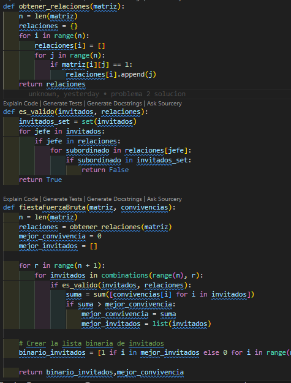

        

    ---

    ### 🔹 `obtener_relaciones(matriz)`

    * Construye una lista de relaciones jefe → subordinado a partir de la matriz de adyacencia.
    * Cada índice `i` contiene una lista con los nodos `j` donde `matriz[i][j] == 1`.

    ---

    ### 🔹 `es_valido(invitados, relaciones)`

    * Verifica si un conjunto de invitados es válido.
    * Recorre cada invitado y revisa que **ningún subordinado directo suyo** también esté invitado.
    * Si hay algún conflicto, retorna `False`; si no, `True`.

    ---

    ### 🔹 `fiestaFuerzaBruta(matriz, convivencias)`

    1. Extrae el número de empleados.

    2. Obtiene las relaciones jerárquicas.

    3. Inicializa variables para guardar la mejor combinación de invitados y el puntaje más alto.

    4. Genera todas las combinaciones posibles de invitados para todos los tamaños (1 a n).

    5. Para cada combinación:

    * Verifica si es válida.
    * Calcula la suma de convivencias.
    * Si supera la mejor, actualiza los valores.

    6. Devuelve:

    * Un vector binario (`1` = invitado, `0` = no invitado).
    * El mejor puntaje total encontrado.

    ---


- **Programación dinámica:** solución óptima basada en postorden del árbol.
  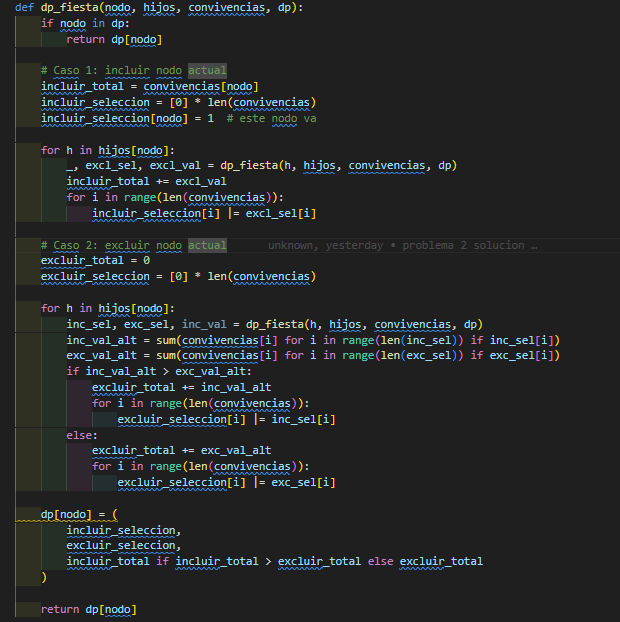


    ---

    ### 🔹 `construir_arbol(matriz)`

    * Recorre la matriz de adyacencia y construye un diccionario `hijos` con las relaciones padre → hijos.
    * Marca quiénes son hijos (`es_hijo[]`) para encontrar la **raíz del árbol**.
    * Retorna la jerarquía y el nodo raíz.

    ---

    ### 🔹 `dp_fiesta(nodo, hijos, convivencias, dp)`

    * Función recursiva con **memoización** (guarda resultados ya calculados en `dp`).

    * Para cada nodo, calcula dos escenarios:

    1. **Incluir el nodo** actual:

        * Se suma su valor de convivencia.
        * Se agregan los valores de **excluir** a sus hijos (para evitar conflictos).
    2. **Excluir el nodo**:

        * Se calcula el mejor resultado posible (mayor valor) entre **incluir o excluir** cada hijo.

    * Devuelve tres cosas:

    * Lista binaria si se incluye.
    * Lista binaria si se excluye.
    * Puntaje total del mejor caso.

    ---

    ### 🔹 `fiesta_programacion_dinamica(matriz, convivencias)`

    1. Construye el árbol y obtiene la raíz.
    2. Llama a `dp_fiesta` desde la raíz para obtener todas las decisiones óptimas.
    3. Compara:

    * El puntaje total si se incluye la raíz.
    * El puntaje total si se excluye.
    4. Retorna:

    * El mejor conjunto de invitados (como lista binaria).
    * La mejor puntuación de convivencia total.

    ---


- **Voraz:** elige empleados con mayor puntaje primero, excluyendo sus jefes e hijos.
    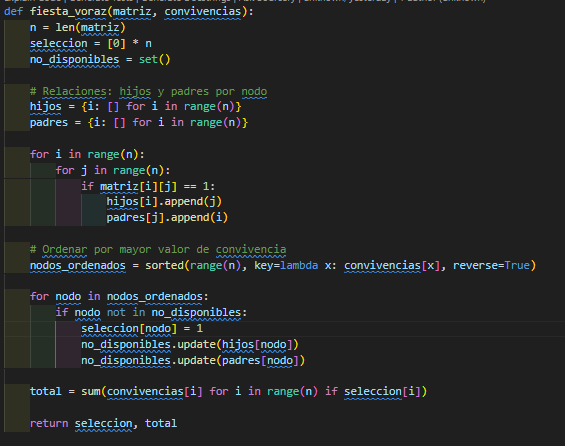

  

    ---

    ### 🔹 `fiesta_voraz(matriz, convivencias)`

    #### 1. **Inicialización**

    * `n`: número de empleados.
    * `seleccion`: lista binaria de empleados invitados (inicialmente todos `0`).
    * `no_disponibles`: conjunto de empleados que no pueden ser invitados porque ya están relacionados (como jefe o subordinado).

    #### 2. **Construcción de relaciones**

    * Se crean los diccionarios `hijos` y `padres` para cada nodo con base en la matriz de adyacencia.
    * `matriz[i][j] == 1` indica que el empleado `i` es jefe directo de `j`.

    #### 3. **Ordenamiento por prioridad**

    * Los nodos se ordenan de mayor a menor convivencia.
    * Esto permite intentar invitar primero a los empleados con mayor valor.

    #### 4. **Selección voraz**

    * Se recorre la lista ordenada.
    * Si el nodo actual no está marcado como no disponible:

    * Se marca como invitado.
    * Se marcan como no disponibles sus jefes y subordinados directos (para evitar conflicto jerárquico).

    #### 5. **Cálculo del total**

    * Se suman las convivencias de los nodos seleccionados.

    #### 6. **Retorno**

    * Devuelve:

    * La lista binaria de invitados.
    * El puntaje total acumulado.

    ---


---


     

---


## 🧪 Resultados y Pruebas

### 🔬 Tipos de pruebas realizadas

-
### Problema de la fiesta


---

### 📈 Análisis de tiempos de ejecución para matriz de 25x25

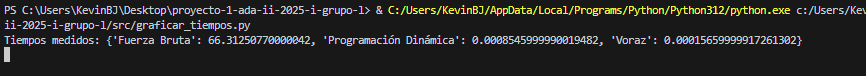


Se midió el tiempo de ejecución de las tres estrategias implementadas (fuerza bruta, programación dinámica y voraz) utilizando una matriz jerárquica de tamaño **25 x 25**.

Los resultados fueron los siguientes:

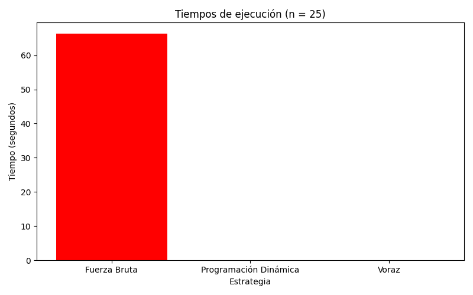


```
Fuerza Bruta:           66.31 segundos
Programación Dinámica:   0.00085 segundos
Voraz:                   0.00016 segundos
```

#### 🧠 Interpretación

* La **estrategia de fuerza bruta**, aunque garantiza encontrar la solución óptima, presenta un **tiempo de ejecución extremadamente alto**, incluso con una entrada moderada de 25 elementos. Esto se debe a su complejidad exponencial, ya que evalúa todas las combinaciones posibles de empleados respetando las restricciones del problema.

* La **programación dinámica** logra encontrar la solución óptima de forma **casi instantánea** gracias a la utilización de subestructuras óptimas propias de árboles, reduciendo drásticamente el espacio de búsqueda.

* La **estrategia voraz** es la más rápida de todas, ya que realiza una selección lineal de nodos basada en el valor de convivencia sin explorar el espacio completo. Sin embargo, esta estrategia no siempre garantiza un resultado óptimo.

#### 📌 Conclusión del experimento fiesta

Este experimento demuestra cómo el enfoque adecuado (en este caso, la programación dinámica) puede ofrecer una **solución óptima y eficiente** incluso para estructuras jerárquicas medianas, mientras que el enfoque voraz puede ser útil en escenarios donde la eficiencia es prioritaria sobre la exactitud. Por otro lado, el enfoque de fuerza bruta **no escala adecuadamente** y solo es práctico para casos de prueba pequeños.

---


## 🛠️ Automatización con GitHub Actions

Se configuró un pipeline en `.github/workflows/python-app.yml` para ejecutar automáticamente:

- Instalación de dependencias
- Ejecución de pruebas unitarias con `pytest`
- Validación de integridad del proyecto

Esto asegura que todos los cambios sean probados antes de integrarse a la rama principal.

---

## ✅ Conclusiones

- La estrategia de **programación dinámica** es ideal para encontrar soluciones óptimas en problemas estructurados como árboles.
- El enfoque **voraz**, aunque eficiente, puede llevar a resultados incorrectos o subóptimos si se valida contra una solución exacta.
- Automatizar pruebas con GitHub Actions mejora la confiabilidad del desarrollo.

---

